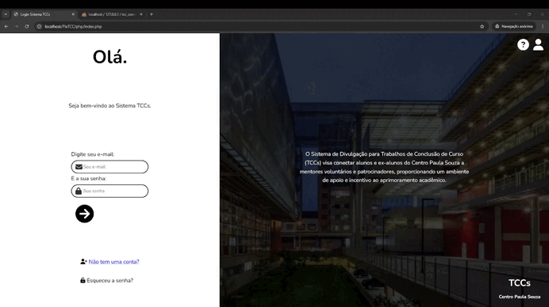

# 📌 Projeto - TCC em PHP

## Sobre Nós

Somos uma turma de **4 desenvolvedores** do **Curso Técnico em Desenvolvimento de Sistemas da ETEC**. Este projeto faz parte do nosso **Trabalho de Conclusão de Curso (TCC)**, onde aplicamos os conhecimentos adquiridos ao longo do curso para desenvolver uma aplicação web funcional utilizando **PHP**.

Nosso sistema conta com páginas essenciais como **Registro**, **Login**, **Página Inicial**, entre outras funcionalidades que demonstram o que aprendemos em back-end, front-end e banco de dados.

---

## Ferramentas Utilizadas

- PHP
- HTML5
- CSS3
- JavaScript
- MySQL (banco de dados)

---

## Demonstrações das Telas

Abaixo você poderá visualizar vídeos demonstrando cada parte do sistema em funcionamento:

### Tela de Registro  

### Tela de Login/ Página Inicial

### 🏠 Página Inicial  
[📽️ *Inserir vídeo aqui*]

### 👤 Página de Perfil  
[📽️ *Inserir vídeo aqui*]

### ⚙️ Outras Funcionalidades  
[📽️ *Inserir vídeo aqui*]

---
