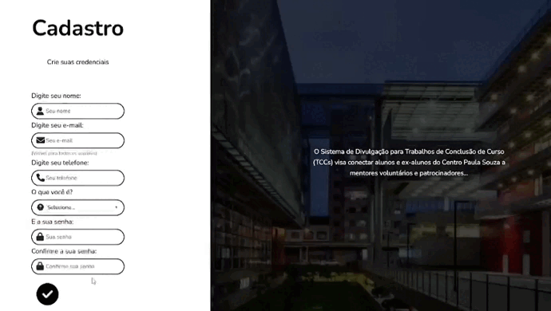
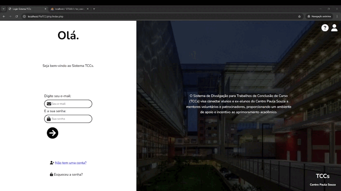
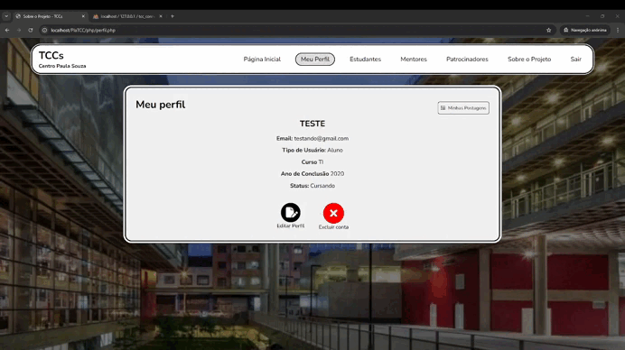
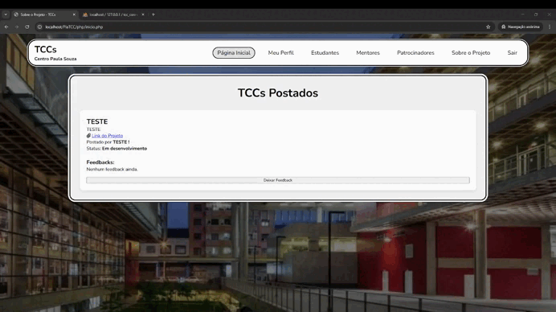

# üìå Projeto - TCC em PHP

## Sobre Nós

Somos uma turma de **4 desenvolvedores** do **Curso Técnico em Desenvolvimento de Sistemas da ETEC**. Este projeto faz parte do nosso **Trabalho de Conclusão de Curso (TCC)**, onde aplicamos os conhecimentos adquiridos ao longo do curso para desenvolver uma aplicação web funcional utilizando **PHP**.

Nosso sistema conta com p√°ginas essenciais como **Registro**, **Login**, **P√°gina Inicial**, entre outras funcionalidades que demonstram o que aprendemos em back-end, front-end e banco de dados.

---

## Ferramentas Utilizadas

- PHP
- HTML5
- CSS3
- JavaScript
- MySQL (banco de dados)

---

## Demonstrações das Telas

Abaixo você poderá visualizar vídeos demonstrando cada parte do sistema em funcionamento:

### Tela de Registro  

### Tela de Login/ P√°gina Inicial

### Editar perfil/ Filtrar estudantes

### Mentores e patrocinadores: P√°gina inicial, feedback e filtro

